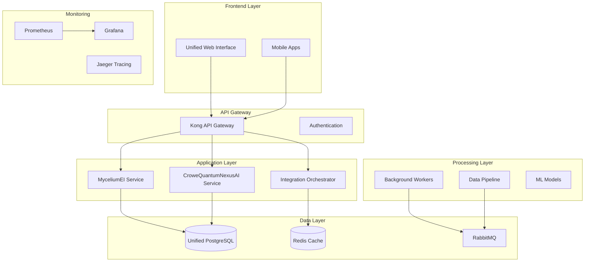

# 🧬 CroweQuantumMyceliumNexus

> **Unified AI Platform** integrating MyceliumEI ecological intelligence with CroweQuantumNexusAI quantum computing capabilities

[](LICENSE)
[](docs/compliance.md)
[](docs/quantum.md)

## 🌟 Overview

CroweQuantumMyceliumNexus represents the convergence of two powerful platforms:
- **MyceliumEI**: Advanced mycological research and environmental monitoring
- **CroweQuantumNexusAI**: Quantum-enhanced artificial intelligence and predictive modeling

This unified platform leverages quantum computing principles to enhance ecological predictions while maintaining EPA compliance and enterprise-grade security.

## 🏗️ Architecture



## 🚀 Key Features

### Integrated Capabilities
- **🍄 Mycological Intelligence**: Real-time fungal growth monitoring and prediction
- **⚛️ Quantum Computing**: Enhanced pattern recognition and optimization
- **🌍 Environmental Monitoring**: EPA-compliant data collection and reporting
- **🤖 AI-Driven Insights**: Advanced predictive models and recommendations
- **📊 Unified Analytics**: Cross-platform data visualization and analysis
- **🔒 Enterprise Security**: End-to-end encryption and compliance features

### Technical Highlights
- **Microservices Architecture**: Scalable, maintainable service design
- **Real-time Data Pipeline**: Streaming data processing with Apache Kafka
- **Quantum-Classical Hybrid**: Seamless integration of quantum and classical computing
- **Multi-tenant Support**: Isolated environments for different organizations
- **API-First Design**: RESTful and GraphQL APIs for all services
- **Cloud-Native**: Kubernetes-ready containerized deployment

## 📦 Quick Start

### Prerequisites
- Windows 10/11 with WSL2
- Docker Desktop
- PowerShell 5.1+
- 16GB RAM minimum
- 100GB free disk space

### Installation

1. **Clone the repository**
```powershell
git clone https://github.com/crowelogic/CroweQuantumMyceliumNexus.git
cd CroweQuantumMyceliumNexus
```

2. **Configure environment**
```powershell
# Generate secure secrets
./scripts/generate-secrets.ps1

# Customize configuration
notepad .env.unified
```

3. **Deploy the platform**
```powershell
# Full deployment with monitoring
./scripts/deploy-unified.ps1 -WithMonitoring -BuildImages

# Or quick deployment (uses pre-built images)
./scripts/deploy-unified.ps1
```

4. **Verify deployment**
```powershell
# Run health checks
./scripts/health-check.ps1

# View service status
docker compose -f docker-compose.unified.yml ps
```

5. **Access the platform**
- Web Interface: http://localhost:3000
- API Gateway: http://localhost:8000
- Grafana Dashboard: http://localhost:3001

## 🔧 Configuration

### Environment Variables
Key configuration options in `.env.unified`:

```bash
# Core Services
DOMAIN=nexus.crowelogic.com
ENVIRONMENT=production

# Features
QUANTUM_COMPUTE_ENABLED=true
AI_ENHANCED_PREDICTIONS=true
EPA_REPORTING_ENABLED=true

# Performance
MAX_WORKERS=4
CACHE_TTL=300
CONNECTION_POOL_SIZE=20
```

### Service Ports
| Service | Port | Description |
|---------|------|-------------|
| Frontend | 3000 | Web UI |
| API Gateway | 8000 | Unified API |
| MyceliumEI | 8100 | Ecological service |
| QuantumNexus | 9000 | Quantum service |
| Grafana | 3001 | Monitoring |
| Prometheus | 9090 | Metrics |

## 📊 Integration Features

### Data Flow Pipelines
The platform includes specialized pipelines for data transformation:

1. **Environmental → Quantum Pipeline**
   - Converts sensor data to quantum state vectors
   - Optimizes for quantum processing

2. **Quantum → Growth Pipeline**
   - Transforms quantum predictions to growth parameters
   - Generates intervention recommendations

3. **Mycelial → AI Pipeline**
   - Extracts network topology features
   - Prepares data for ML models

4. **Compliance Sync Pipeline**
   - Synchronizes EPA compliance data
   - Generates unified reports

### API Endpoints

#### MyceliumEI APIs
```
GET  /api/v1/environmental/current
GET  /api/v1/environmental/history
POST /api/v1/growth/predict
GET  /api/v1/compliance/report
```

#### CroweQuantumNexusAI APIs
```
POST /api/v2/quantum/compute
GET  /api/v2/quantum/status
POST /api/v2/ai/predict
GET  /api/v2/models/list
```

#### Integration APIs
```
POST /api/integration/route
GET  /api/integration/pipelines
GET  /api/integration/metrics
POST /api/integration/transform
```

## 🔐 Security & Compliance

### Security Features
- **JWT Authentication**: Token-based auth with refresh tokens
- **Role-Based Access Control**: Granular permissions
- **End-to-End Encryption**: TLS 1.3 for all communications
- **Audit Logging**: Complete audit trail for compliance
- **Security Scanning**: Automated vulnerability detection

### EPA Compliance
- **7-Year Data Retention**: Automated backup and archival
- **Audit Trail**: Complete data lineage tracking
- **Compliance Reporting**: Automated EPA report generation
- **Data Quality Metrics**: Continuous quality monitoring

## 📈 Monitoring & Observability

### Metrics Collection
- **Application Metrics**: Response times, error rates, throughput
- **Infrastructure Metrics**: CPU, memory, disk, network
- **Business Metrics**: User activity, data processing, compliance

### Dashboards
Pre-configured Grafana dashboards for:
- System Overview
- Application Performance
- Data Pipeline Status
- Compliance Metrics
- Quantum Computing Utilization

### Distributed Tracing
Jaeger integration for:
- Request flow visualization
- Performance bottleneck identification
- Service dependency mapping

## 🧪 Testing

```powershell
# Run unit tests
./scripts/run-tests.ps1 -Unit

# Run integration tests
./scripts/run-tests.ps1 -Integration

# Run performance tests
./scripts/run-tests.ps1 -Performance

# Run compliance tests
./scripts/run-tests.ps1 -Compliance
```

## 📚 Documentation

- [Architecture Guide](docs/architecture.md)
- [API Documentation](docs/api.md)
- [Integration Guide](docs/integration.md)
- [Deployment Guide](docs/deployment.md)
- [Security Guide](docs/security.md)
- [Compliance Guide](docs/compliance.md)

## 🤝 Contributing

Please see [CONTRIBUTING.md](CONTRIBUTING.md) for guidelines on how to contribute to this project.

## 📄 License

This project is proprietary software. See [LICENSE](LICENSE) for details.

## 🏢 About Crowe Logic

Crowe Logic specializes in advanced AI solutions combining quantum computing with ecological intelligence for next-generation environmental monitoring and optimization.

### Contact
- **Website**: https://crowelogic.com
- **Email**: support@crowelogic.com
- **GitHub**: https://github.com/crowelogic

## 🚨 System Status

| Component | Status | Version |
|-----------|--------|---------|
| MyceliumEI | ✅ Active | v2.0.0 |
| CroweQuantumNexusAI | ✅ Active | v1.5.0 |
| Integration Layer | ✅ Active | v1.0.0 |
| EPA Compliance | ✅ Compliant | 2025 Standards |

---

**© 2025 Crowe Logic. All Rights Reserved.**

*Built with quantum intelligence for a sustainable future* 🌍⚛️🍄